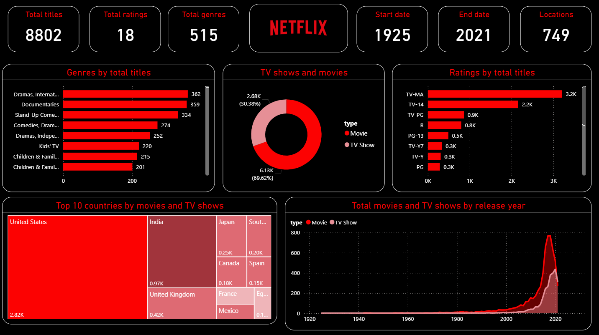

# 🎬 Netflix Content Insights Dashboard

## 📌 Project Overview

This Power BI dashboard provides an in-depth analysis of Netflix's content library, helping users explore trends across movies, TV shows, genres, ratings, countries, and release years.

The dashboard is designed to uncover valuable insights about Netflix's content distribution and growth over time using interactive visualizations and key performance indicators (KPIs).

---

## 📊 Dashboard Preview



---

## 🎯 Objectives

- Analyze Netflix content distribution.
- Compare Movies vs TV Shows.
- Identify the most popular genres.
- Explore content ratings across titles.
- Discover top contributing countries.
- Track content growth over time.

---

## 📈 Key KPIs

| KPI | Value |
|------|--------|
| Total Titles | 8,802 |
| Total Ratings | 18 |
| Total Genres | 515 |
| Total Locations | 749 |
| Start Year | 1925 |
| End Year | 2021 |

---

## 📊 Visualizations Included

### 1️⃣ Genres by Total Titles
Displays the most common genres available on Netflix.

### 2️⃣ Movies vs TV Shows
Donut chart showing the proportion of Movies and TV Shows.

### 3️⃣ Ratings by Total Titles
Shows content distribution across different maturity ratings.

### 4️⃣ Top 10 Countries by Content
Treemap visualization highlighting countries with the highest number of Netflix titles.

### 5️⃣ Content Growth by Release Year
Line chart illustrating how Netflix content has expanded over time.

---

## 🔍 Key Insights

- Movies account for approximately **70%** of Netflix content.
- TV Shows contribute around **30%** of the platform's library.
- The **United States** has the largest content contribution.
- Drama-related genres dominate Netflix's catalog.
- Content growth accelerated significantly after 2015.
- Netflix experienced peak content additions between 2018 and 2020.

---

## 🛠️ Tools & Technologies

- Power BI
- Power Query
- DAX
- Data Modeling
- Data Visualization

---

## 📂 Dataset Features

- Title
- Type (Movie / TV Show)
- Director
- Country
- Release Year
- Rating
- Genre
- Date Added

---

## 🚀 Skills Demonstrated

- Data Cleaning
- Data Transformation
- Data Modeling
- DAX Measures
- Dashboard Design
- Business Intelligence Reporting
- Data Storytelling

---

## 📁 Project Structure

```text
Netflix-Content-Insights-Dashboard/
│
├── Netflix_Content_Insights_Dashboard.pbix
├── Netflix_Content_Insights_Dashboard.png
├── Netflix_Dataset.csv
└── README.md
```

---

## 💡 Business Value

This dashboard enables users to:

- Understand Netflix content trends.
- Identify dominant genres and ratings.
- Analyze geographic content distribution.
- Track historical growth patterns.
- Support content strategy and decision-making.

---

## 👩‍💻 Author

**Nikita Yadav**

Aspiring Data Analyst skilled in:

- Python
- SQL
- Power BI
- Tableau
- Excel
- Data Analysis
- Machine Learning

⭐ If you found this project useful, consider giving it a star!
